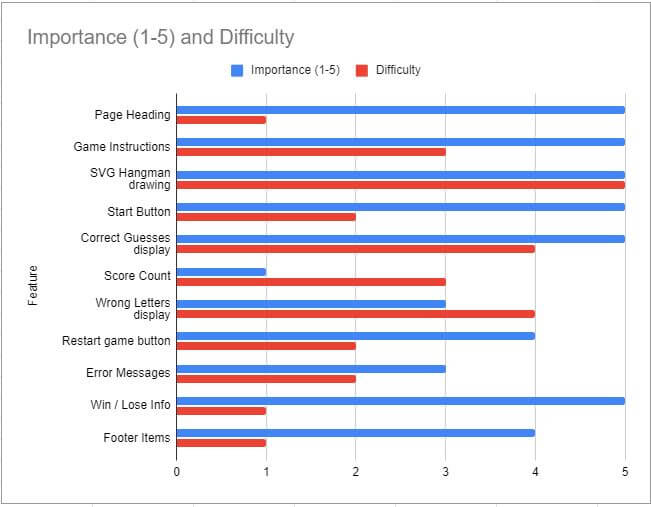

# JavaScript Hangman Game
The live website can be found [here]()

## Purpose

This Website was created for the sole purpose of completing the second Milestone Project for the Code Institute's Full Stack Developer course. It was built using the knowledge gained from the HTML, CSS, User Centric Design, JavaScript Fundamentals and Interactive Frontend Development modules. A full list of technologies used can be found in the [technologies](#Technologies-Used) section of this document.

## Table of Contents
* [User Experience Design (UX)](#User-Experience-Design)
    * [The Strategy Plane](#The-Strategy-Plane)
        * [User stories](#User-Stories)
    * [The Scope Plane](#The-Scope-Plane)
    * [The Structure Plane](#The-Structure-Plane)
    * [The Skeleton Plane](#The-Skeleton-Plane)
        * [Wireframes](#Wireframes)
    * [The Surface Plane](#The-Surface-Plane)
        * [Design](#Design)
            * [Colour Scheme](#Colour-Scheme)
            * [Typography](#Typography)
            * [Imagery](#Imagery)
    * [Differences to Design](#Differences-to-Design)
- [Features](#Features)
    * [Existing Features](#Existing-Features)
    * [Future Features](#Features-Left-to-Implement)
* [Technologies](#Technologies)
* [Testing](#Testing)
* [Deployment](#Deployment)
    * [Project Creation](#Project-Creation)
    * [GitHub Pages](#Using-Github-Pages)
    * [Locally](Run-Locally)
* [Credits](#Credits)
  * [Content](#Content)
  * [Media](#Media)
  * [Acknowledgements](#Acknowledgements)
  * [Comments](#Comments)

****

## User Experience Design
### **The Strategy Plane**
This website was created to showcase my knowledge of HTML, CSS & JavaScript and to provide users with some entertainment in the form of an online Hangman game created with JavaScript and SVG and jQuery. The game should be easy to understand, simple to interactive with and give feedback to the user on all inputs.

Site Goals:
* To showcase the skills I have learnt in HTML, CSS, JS.
* To provide users with an interactive game to play that has clear Win / Lose Scenarios.
* To create an enjoyable, interactive game that makes the user want to stay and play again.
* To create a game that makes the user want to return to the website.

#### User stories
* As a user, I want to easily understand the main purpose of the site.
* As a user, I want to view the website and content clearly on my any device.
* As a user, I want to be able to play a game that contains instructions so that I understand how to play.
* As a user, I want to know whether my guess was successful or not.
* As a user, I want a way to start a new game when the current game has ended.
* As a user, I want to see my score so that I know how many games I have won or lost.

### **The Scope Plane**
Features planned:
* Page Heading - A page heading that has a clear caption what the page is about.
* An interactive Hangman Game.
* Game Instructions - Clear instructions on how to play the game.
* An SVG drawing of Hangman.
* Start Button.
* Correct Guesses displayed.
* Score Count.
* Wrong Letters displayed.
* Restart Game button.
* Error messages with incorrect guesses.
* Win / Lose information.
* Footer Items - Contact Information and link GitHub Profile / Repo.

**Feature Scale**  

### **The Structure Plane**

### **The Skeleton Plane**
#### Wireframes

### **The Surface Plane**
### Design

#### Colour Scheme

#### Typography

#### Imagery

#### Differences to Design
****
## Features

### Existing Features

### Features Left to Implement
****
## Technologies

****
## Testing

**Bugs found and fixed during testing:**
****
## Deployment

### Project Creation
To create this project I initialised the repository by typing the following command into the bash terminal in Visual studio code:
* git init

For the initial commit I clicked on the Source Control menu on the side bar in Visual Studio code. Added the change to the staging area by clicking the '+' icon next to the file name. I then added a commit message in the text box below source control. Lastly I clicked on the Public to GitHub icon in the bottom left hand side of Visual Studio Code and I was then prompted with the following two options:
    
    * Publish to GitHub private repository
    * Public to GitHub public repository

I selected publish to GitHub public repository and my first commit was published.

The following commands were used for version control throughout the project:
* git add filename - This command was used to add fils to the staging area before commiting.
* git commit -m "commit message explaining the updates" - This command was used to to commit changes to the local repository.
* git push - This command is used to push all commited changes to the GitHub repository.

### Using Github Pages

### Run Locally

****
## Credits

### Code

### Media

### Acknowledgements
****
## Comments
